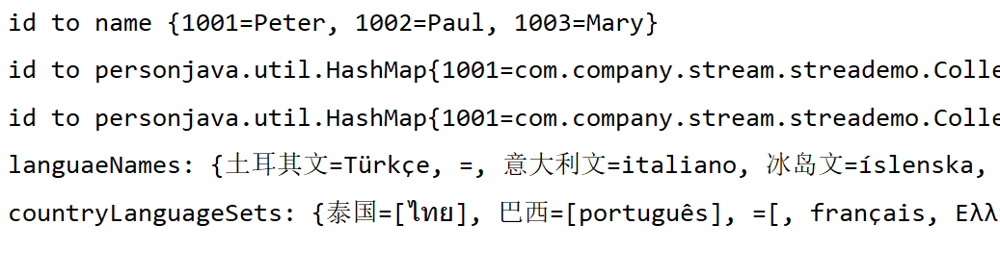

####  迭代变成流式操作

```java
        //传统的写法
        int count = 0;
        for (String w : words) {
            if (w.length() > 12) {
                count++;
            }
        }

        //流式写法
        long count2 = words.stream()
                .filter(w -> w.length() > 12)
                .count();
```

可以把stream换成parallelStream自动达到并行执行的目的


流表面上看起来跟集合类似，但是它们之间有显著差异：

- 流并不存储元素
- 流的操作不会修改其数据源
- 流的操作是尽可能惰性执行


简单的创建流代码

```java
        //生成一个字符串流
        Stream<String> stringStream = Stream.of("aaaa");
        Stream<String> stringStream2 = Stream.generate(() -> "bbbb");
        //生成随机数流 下面三段代码等价
        Stream<Double> randoms = Stream.generate(Math::random);

        Stream<Double> randoms2 = Stream.generate(() -> Math.random());

        Stream<Double> randoms3 = Stream.generate(new Supplier<Double>() {
            @Override
            public Double get() {
                return Math.random();
            }
        });
        //生成0,1,2这样的流
        Stream<BigInteger> integerStream = Stream.iterate(BigInteger.ZERO, n -> n.add(BigInteger.ONE));
        //生成0,1,2这样的流 最大不超过10000000000000000的
        BigInteger bigInteger = new BigInteger("10000000000000000");
```

如果我们持有的Iterable对象不是集合，那么可以通过下面的调用将其转换为一个流：

StreamSupport.stream(iterbale.spliterator(), false)


更多创建流demo

```java
package com.company.stream.streademo;

import java.io.IOException;
import java.math.BigInteger;
import java.nio.charset.StandardCharsets;
import java.nio.file.*;
import java.util.Iterator;
import java.util.List;
import java.util.Spliterator;
import java.util.Spliterators;
import java.util.regex.Pattern;
import java.util.stream.Collectors;
import java.util.stream.Stream;
import java.util.stream.StreamSupport;

public class CreatingStreams {

    public static <T> void show(String title, Stream<T> stream) {
        final int SIZE = 10;
        List<T> firstElement = stream.limit(SIZE + 1).collect(Collectors.toList());
        System.out.print(title + ":");
        for (int i = 0; i < firstElement.size(); i++) {
            if (i > 0) {
                System.out.print(", ");
            }
            if (i < SIZE) {
                System.out.print(firstElement.get(i));
            } else {
                System.out.print("...");
            }
        }
        System.out.println();
    }

    public static void main(String[] args) throws IOException {
        Path path = Paths.get("C:\\Users\\Sanit\\Downloads\\a.txt");
        String contents = new String(Files.readAllBytes(path), StandardCharsets.UTF_8);

        Stream<String> words = Stream.of(contents.split("\\PL+"));
        show("words", words);
        Stream<String> song = Stream.of("gently", "down", "the", "stream");
        show("song", song);
        Stream<String> silence = Stream.empty();
        show("silence", silence);

        Stream<String> echos = Stream.generate(() -> "Echo");
        show("echos", echos);

        Stream<Double> randoms = Stream.generate(Math::random);
        show("randoms", randoms);

        Stream<BigInteger> integers = Stream.iterate(BigInteger.ONE, n->n.add(BigInteger.ONE));
        show("integers", integers);

        Stream<String> wordsAnotherWay = Pattern.compile("\\PL+").splitAsStream(contents);
        show("wordsAnotherWay", wordsAnotherWay);

        try (Stream<String> lines = Files.lines(path, StandardCharsets.UTF_8)){
            show("lines", lines);
        }

        Iterable<Path> iterable = FileSystems.getDefault().getRootDirectories();
        Stream<Path> rootDirectories = StreamSupport.stream(iterable.spliterator(), false);
        show("rootDirectories", rootDirectories);

        Iterator<Path> iterator = Paths.get("C:\\Users\\Sanit\\Downloads\\a.txt").iterator();
        Stream<Path> pathComponents = StreamSupport.stream(Spliterators.spliteratorUnknownSize(iterator,
                Spliterator.ORDERED), false);
        show("pathComponents", pathComponents);
    }
}
```

输出

```java
words:aaa, nnnn, ssss, ddddd
song:gently, down, the, stream
silence:
echos:Echo, Echo, Echo, Echo, Echo, Echo, Echo, Echo, Echo, Echo, ...
randoms:0.08474006253437971, 0.8936153787991608, 0.6538510865930046, 0.00796584935432365, 0.29101447407020753, 0.255738502556359, 0.729617622381173, 0.9325695158948093, 0.5035121016507018, 0.7511720617654059, ...
integers:1, 2, 3, 4, 5, 6, 7, 8, 9, 10, ...
wordsAnotherWay:aaa, nnnn, ssss, ddddd
lines:aaa, nnnn, ssss, ddddd
rootDirectories:C:\, D:\, Y:\, Z:\
pathComponents:Users, Sanit, Downloads, a.txt
```


在执行流操作的时候，我们并没有修改流背后的集合，如果修改了原先集合里的数据，那么流操作的结果就会编程未定义的。JDK文档称这种要求为**不干涉性**

```java
        //这段代码可以跑
        List<String> wordList = Arrays.asList("xxx1", "xxxx2");
        Stream<String> words = wordList.stream();
        wordList.add("xxxx3");
        long n = words.distinct().count();

        //这个代码是错的 会报错
        Stream<String> words2 = wordList.stream();
        words.forEach(s -> {
            if (s.length() < 12) wordList.remove(s);
        });
```


#### filter、map和flatMap方法

* filter 产生一个流，它包含当前流中所有满足条件的元素
* map 产生一个流，他包含讲mapper应用于当前流中所有元素所产生的结果
* flatMap 产生一个流， 他是通过讲mapper应用于当前所有元素所产生的结果连接到一起而获得（注意，这里的每个结果都是一个流）


```java
        Stream<String> longWords = wordList.stream().filter(w -> w.length() > 12);

        Stream<String> lowercaseWords = wordList.stream().map(String::toLowerCase);

        Stream<String> firstLetters = wordList.stream().map(s -> s.substring(0, 1));

        //Stream<String> result = wordList.stream().map(w -> codePoints(w));

        Stream<String> result = wordList.stream().flatMap(Iterate::codePoints);
```


#### 其它流方法

limit

takeWhile

dropWhile

skip

concat

distinct

sorted

peek

count

min（返回Optional）

max（返回Optional）

findFirst（返回Optional）

findAny（返回Optional）

....这些方法基本上都是它名字就代表了它的含义


#### Optional类型

Optional<T>对象是一种包装器独享，要么包装了T对象，要么没有包装任何对象。对于前者，Optional<T>被当做一种更安全的方式，用来代替类型T的应用，这种引用要么引用某个对象，要么为null

* Optional类型的变量永远都不应该为null
* 不要使用Optional类型的域。因为其代价是额外多出来一个对象。在类的内部，使用null表示缺失的域更易于操作。
* 不要在集合中放置Optional对象，并且不要将他们用作map的键。应该收集其中的值。


Optional类示例：

```java
package com.company.stream.streademo;

import java.io.IOException;
import java.nio.charset.StandardCharsets;
import java.nio.file.Files;
import java.nio.file.Paths;
import java.util.*;

public class OptionalTest {
    public static void main(String[] args) throws IOException {
        String contents = new String(Files.readAllBytes(Paths.get("C:\\Users\\Sanit\\Downloads\\a.txt")),
                StandardCharsets.UTF_8);
        List<String> wordList = Arrays.asList(contents.split("\\PL+"));

        Optional<String> optionalValue = wordList.stream().filter(s -> s.contains("fred")).findFirst();
        System.out.println(optionalValue.orElse("No word") + " contains fred");

        Optional<String> optionalString = Optional.empty();
        String result = optionalString.orElse("N/A");
        System.out.println("result: " + result);
        result = optionalString.orElseGet(() -> Locale.getDefault().getDisplayName());
        System.out.println("result: " + result);
        try {
            result = optionalString.orElseThrow(IllegalStateException::new);
            System.out.println("result: " + result);
        } catch (Throwable t) {
            t.printStackTrace();
        }

        optionalValue = wordList.stream().filter(s -> s.contains("red")).findFirst();
        optionalValue.ifPresent(s -> System.out.println(s + " contains red"));

        HashSet<String> results = new HashSet<>();
        optionalValue.ifPresent(results::add);
        Optional<Boolean> added = optionalValue.map(results::add);
        System.out.println(added);

        System.out.println(inverse(4.0).flatMap(OptionalTest::squareRoot));
        System.out.println(inverse(-1.0).flatMap(OptionalTest::squareRoot));
        System.out.println(inverse(0.0).flatMap(OptionalTest::squareRoot));
        Optional<Double> result2 = Optional.of(-4.0).flatMap(OptionalTest::inverse).flatMap(OptionalTest::squareRoot);
        System.out.println(result2);
    }

    public static Optional<Double> inverse(Double x) {
        return x == 0 ? Optional.empty() : Optional.of(1 / x);
    }

    public static Optional<Double> squareRoot(Double x) {
        return x < 0 ? Optional.empty() : Optional.of(Math.sqrt(x));
    }
}
```

输出：

```java
No word contains fred
result: N/A
result: 中文 (中国)
Optional.empty
Optional[0.5]
Optional.empty
Optional.empty
Optional.empty
java.lang.IllegalStateException
	at com.company.stream.streademo.OptionalTest$$Lambda$5/9286386.get(Unknown Source)
	at java.util.Optional.orElseThrow(Optional.java:290)
	at com.company.stream.streademo.OptionalTest.main(OptionalTest.java:24)
```


Optional里面的flatMap在正常结果的情况下会将当前结果应用于Optional类，如果为空则返回一个空的Optional。而map方法是生成一个Optional

比如把System.out.println(inverse(4.0).flatMap(OptionalTest::squareRoot));改为map，那么结果为Optional[Optional[0.5]]


#### 收集流结果 collect

```java
package com.company.stream.streademo;

import java.io.IOException;
import java.nio.charset.StandardCharsets;
import java.nio.file.Files;
import java.nio.file.Paths;
import java.util.*;
import java.util.stream.Collectors;
import java.util.stream.Stream;

public class CollectingResults {
    public static Stream<String> noVowels() throws IOException {
        String contents = new String(Files.readAllBytes(Paths.get("C:\\Users\\Sanit\\Downloads\\a.txt")),
                StandardCharsets.UTF_8);
        List<String> wordList = Arrays.asList(contents.split("\\PL+"));
        Stream<String> words = wordList.stream();
        return words.map(s -> s.replaceAll("[aeiouAEIOU]]", ""));
    }

    public static <T> void show(String label, Set<T> set) {
        System.out.println(label + ": " + set.getClass().getName());
        System.out.println("[" +
                set.stream().limit(10).map(Object::toString).collect(Collectors.joining(", ")) + "]");
    }

    public static void main(String[] args) throws IOException {
        Iterator<Integer> iter = Stream.iterate(0, n -> n + 1).limit(10).iterator();
        while (iter.hasNext()) {
            System.out.println(iter.next());
        }
        Object[] numbers = Stream.iterate(0, n -> n + 1).limit(10).toArray();
        System.out.println("Object array:" + numbers);

        try {
            Integer number = (Integer) numbers[0];
            System.out.println("number:" + number);
            System.out.println("The following statement throw an exception:");
            Integer[] number2 = (Integer[]) numbers;
        } catch (ClassCastException e) {
            System.out.println(e);
        }

        Integer[] number3 = Stream.iterate(0, n -> n + 1).limit(10).toArray(Integer[]::new);
        System.out.println("Integer array:" + number3);

        Set<String> noVowelSet = noVowels().collect(Collectors.toCollection(TreeSet::new));
        show("noVowelTreeSet", noVowelSet);

        String result = noVowels().limit(10).collect(Collectors.joining());
        System.out.println("Joining: " + result);
        result = noVowels().limit(10).collect(Collectors.joining(", "));
        System.out.println("Joining with commas: " + result);

        IntSummaryStatistics summary = noVowels().collect(Collectors.summarizingInt(String::length));
        double averageWordLength = summary.getAverage();
        double maxWordLength = summary.getMax();
        System.out.println("average word len: " +averageWordLength);
        System.out.println("max word len: "+maxWordLength);
        System.out.println("forEach: ");
        noVowels().limit(10).forEach(System.out::println);
    }
}
```

输出：

```java
0
1
2
3
4
5
6
7
8
9
Object array:[Ljava.lang.Object;@19a45b3
number:0
The following statement throw an exception:
java.lang.ClassCastException: [Ljava.lang.Object; cannot be cast to [Ljava.lang.Integer;
Integer array:[Ljava.lang.Integer;@103e736
noVowelTreeSet: java.util.TreeSet
[aaa, ddddd, nnnn, ssss]
Joining: aaannnnssssddddd
Joining with commas: aaa, nnnn, ssss, ddddd
average word len: 4.0
max word len: 5.0
forEach: 
aaa
nnnn
ssss
ddddd
```


收集到映射表中：

```java
package com.company.stream.streademo;

import java.io.IOException;
import java.util.*;
import java.util.function.Function;
import java.util.stream.Collectors;
import java.util.stream.Stream;

public class CollectingIntoMaps {
    public static class Person {
        private int id;
        private String name;

        public Person(int id, String name) {
            this.id = id;
            this.name = name;
        }

        public int getId() {
            return id;
        }

        public String getName() {
            return name;
        }

        @Override
        public String toString() {
            return getClass().getName() + "[" +
                    "id=" + id +
                    ", name='" + name +
                    ']';
        }
    }

    public static Stream<Person> people() {
        return Stream.of(new Person(1001, "Peter"), new Person(1002, "Paul"), new Person(1003, "Mary"));
    }

    public static void main(String[] args) throws IOException {
        Map<Integer, String> idToName = people().collect(Collectors.toMap(Person::getId, Person::getName));
        System.out.println("id to name " + idToName);

        Map<Integer, Person> idToPerson = people().collect(Collectors.toMap(Person::getId, Function.identity()));
        System.out.println("id to person" + idToPerson.getClass().getName() + idToPerson);

        idToPerson = people().collect(Collectors.toMap(Person::getId, Function.identity(), (existingValue, newValue) -> {
            throw new IllegalStateException();
        }));
        System.out.println("id to person" + idToPerson.getClass().getName() + idToPerson);

        Stream<Locale> locales = Stream.of(Locale.getAvailableLocales());
        Map<String, String> languageNames = locales.collect(Collectors.toMap(
                Locale::getDisplayLanguage,
                l -> l.getDisplayLanguage(l),
                (existingValue, newValue) -> existingValue
        ));
        System.out.println("languaeNames: " + languageNames);

        locales = Stream.of(Locale.getAvailableLocales());
        Map<String, Set<String>> countryLanguageSets = locales.collect(
                Collectors.toMap(
                        Locale::getDisplayCountry,
                        l -> new HashSet<>(Collections.singletonList(l.getDisplayLanguage(l))),
                        (a, b) ->
                        {
                            Set<String> union = new HashSet<>(a);
                            union.addAll(b);
                            return union;
                        }
                )
        );
        System.out.println("countryLanguageSets: " + countryLanguageSets);
    }
}
```

输出:



#### 下游收集器

groupingBy 和partitioningBy

partitionBy会产生true或者false的键值的映射表，groupingBy会产生应用到所有元素后产生的结果作为键值的映射表


#### 基本流类型

```java
package com.company.stream.streademo;

import java.io.IOException;
import java.nio.charset.StandardCharsets;
import java.nio.file.Files;
import java.nio.file.Paths;
import java.util.stream.Collectors;
import java.util.stream.IntStream;
import java.util.stream.Stream;

public class PrimitiveTypeStreams {
    public static void show(String title, IntStream intStream) {
        final int SIZE = 10;
        int[] firstElements = intStream.limit(SIZE+1).toArray();
        System.out.println(title);
        for (int i = 0;i<firstElements.length;i++) {
            if(i>0) {
                System.out.print(", ");
            }
            if(i<SIZE) {
                System.out.print(firstElements[i]);
            }else {
                System.out.print("...");
            }
        }
        System.out.println();
    }

    public static void main(String[] args) throws IOException {
        IntStream is1 = IntStream.generate(()->(int)(Math.random() * 100));
        show("is1", is1);
        IntStream is2 = IntStream.range(5, 10);
        show("is2", is2);
        IntStream is3 = IntStream.rangeClosed(5, 10);
        show("is3", is3);

        String contents = new String(Files.readAllBytes(Paths.get("C:\\Users\\Sanit\\Downloads\\a.txt")),
                StandardCharsets.UTF_8);
        Stream<String> words = Stream.of(contents.split("\\PL+"));
        IntStream is4 = words.mapToInt(String::length);
        show("is4", is4);

        String sentence = "\uD835\uDD46 is the set of octonions";
        System.out.println(sentence);
        IntStream codes = sentence.codePoints();
        System.out.println(codes.mapToObj(c-> String.format("%X", c)).collect(Collectors.joining()));

        Stream<Integer> integerStream = IntStream.range(0,100).boxed();
        IntStream is5 = integerStream.mapToInt(Integer::intValue);
        show("is5", is5);
    }
}
```


#### 并行流

可以用Collection.parallelStream方法从任何一个集合中获取一个并行流。parallel可将任意顺序流转成并行流。

* 并行化会导致大量的开销，只有面对非常大的数据集才划算
* 只有在底层数据源可以被有效分割为多个部分时，将流并行化才有意义
* 并行流使用的线程池可能会因诸如文件I/O或网络访问这样的操作被阻塞而饿死。只有面对海量的内存数据和运算密集处理，并行流才会工作最佳。

```java
package com.company.stream.streademo;

import java.io.IOException;
import java.nio.charset.StandardCharsets;
import java.nio.file.Files;
import java.nio.file.Paths;
import java.util.Arrays;
import java.util.List;
import java.util.Map;
import java.util.stream.Collectors;

public class ParallelStreams {
    public static void main(String[] args) throws IOException {
        String contents = new String(Files.readAllBytes(Paths.get("C:\\Users\\Sanit\\Downloads\\a.txt")),
                StandardCharsets.UTF_8);
        List<String> wordList = Arrays.asList(contents.split("\\PL+"));

        int[] shortWords = new int[10];
        wordList.parallelStream().forEach(
                s ->
                {
                    if (s.length() < 10) shortWords[s.length()]++;
                }
        );
        System.out.println(Arrays.toString(shortWords));

        Arrays.fill(shortWords, 0);
        wordList.parallelStream().forEach(
                s ->
                {
                    if (s.length() < 10) shortWords[s.length()]++;
                }
        );
        System.out.println(Arrays.toString(shortWords));

        Map<Integer, Long> shortWordCounts = wordList.parallelStream().filter(s -> s.length()<10).collect(
                Collectors.groupingBy(String::length, Collectors.counting())
        );
        System.out.println(shortWordCounts);

        Map<Integer, List<String>> result = wordList.parallelStream().collect(
                Collectors.groupingByConcurrent(String::length)
        );
        System.out.println(result.get(3));

        result = wordList.parallelStream().collect(Collectors.groupingByConcurrent(String::length));
        System.out.println(result.get(3));

        Map<Integer,Long> wordCounts = wordList.parallelStream().collect(Collectors.groupingByConcurrent(String::length, Collectors.counting()));

        System.out.println(wordCounts);
    }
}
```

parallelStream并不是线程安全的